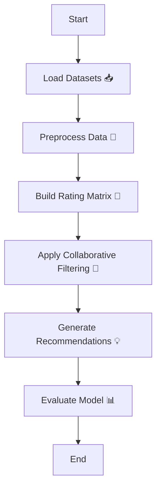

# ML-project4-Movie-Recommender-System


A machine learning project for building a movie recommender system using collaborative filtering.

---

## 🎬 Project Overview

This repository demonstrates the construction of a movie recommender system using collaborative filtering techniques. The system suggests movies to users based on their previous ratings and similarities to other users.

---

## 📂 Contents

| File/Folder                    | Description                                              |
|--------------------------------|---------------------------------------------------------|
| `Project 8 - Movie Recommender System.ipynb`   | Jupyter Notebook with code & explanations              |
| `Project 8 - Recommender Systems.pptx`         | Project presentation slides                            |
| `Movie_Id_Titles`              | Movie titles and IDs mapping                            |
| `My_Ratings.csv`               | User ratings dataset                                    |
| `u.data`                       | Movie ratings data                                      |
| `LICENSE`                      | License information for this repository                 |
| `README.md`                    | This file                                               |

---

## ⚙️ Flowchart

Below is a simple flowchart illustrating the movie recommendation process:



---

## 💻 Getting Started

1. **Clone the repository:**
   ```bash
   git clone https://github.com/mdzaheerjk/ML-project4-Movie-Recommender-System.git
   ```

2. **Open the Jupyter Notebook:**
   - Ensure you have Python and Jupyter installed.
   - Open `Project 8 - Movie Recommender System.ipynb` to view and run the code.

3. **Run the cells:**
   - Follow the instructions in the notebook to load the data, preprocess it, build the recommender, and generate movie recommendations.

---

## 🧰 Requirements

- 
- 
- 
- 

Install dependencies with:
```bash
pip install pandas numpy scikit-learn notebook
```

---

## 🏆 Results

- The system makes personalized movie recommendations based on user ratings.
- You can experiment with different similarity metrics and filtering methods to improve recommendation quality.

---

## 📄 License

This project is licensed under the [MIT License](LICENSE).

---

## 👤 Author

**mdzaheerjk**

---

Feel free to fork this repository and enhance the recommender system or adapt it for other recommendation tasks!
